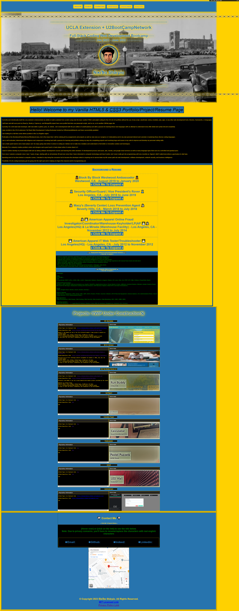

#Project Name: Ńἱĸἱ৳α $hârρἱ0's UCLAx-U2 Portfolio

###### Development For:

UCLA Extension's & U2 Network Boot Camp's
Full-Stack Web Development Coding Boot Camp 2021-2022

---

## Module 2 - Challange 2 Assignment:

---

### Project Description:

My portfolio/project/resume for UCLAx-U2 using Vanilla HTML5 and CSS3 only.
This was the 2nd Challenge Assignment for Module 2 during this Full-Stack Web Dev Coding Boot Camp course.

Additional info:

- After Completing UCLAx-U2 Full-Stack Web Development Coding Boot Camp back in June 2022, I've had the chance to redo this project.
- I am fully aware project section is incomplete and needs fixing. I plan to revamping/redoing/rebuilding all my other projects and I will Upload and Put all the projects and modules in this repo or gitpage in the up coming weeks and months. I will use the runbuddyv2 project style for all my other projects.
- Its going to be a tough callange after Heroku shutdown its free tier and sql and is no longer free.
- Therfor it may take some time.
- I will return to this project after I get finishing remastering most of my projects.

---

### GitHub Information:

#### Live Deployed Website Link:

[Hosted by GitHub Pages - https://niksharpkings.github.io/my-portfolio-uclax-C2/](https://niksharpkings.github.io/my-portfolio-uclax-C2/)

### GitHub Repository Link:

[GitHub Repo - https://github.com/Niksharpkings/my-portfolio-uclax-C2](https://github.com/Niksharpkings/my-portfolio-uclax-C2)

---

### Development Information:

#### Coding Language Used:

1) `HTML5`
2) `CSS3`

#### Program/Software Used:

1) [VScode - https://code.visualstudio.com/](https://code.visualstudio.com/)
2) [VScode Extensions: open in browser](https://marketplace.visualstudio.com/items?itemName=techer.open-in-browser)
3) [GitBash - https://gitforwindows.org/](https://gitforwindows.org/)
4) [GitHub - https://github.com/](https://github.com/)

---

#### ScreenShot of Deployed Website:



---

###### Licence, Privacy & Policy Note:

```
This repoitory and contents was originally created and designed by by me, Nikita "Nik" Sharpio aka account named "niksharpkings" for you UCLA Extension + U2 Network Boot Camp for the Full-Stack Web Development Coding Boot Camp 2021-2022 as a class turn-in assignment and as a resume/github profile that demostrates my understanding and programing skills with standard semantic vanilla/default HTML5 & CSS3 only. I fully claiming ownership/design/creater/developer of this project with exception of the linked files for modules that are non-challanges as those are created by school for demostration purposes and for allowed remodification and play-testing of functions and usages. For those selected content please read the README.md & LICENSE for info about those repositories as they contain additional information about them. I do not intend or plan to claim any ownership or rights of those contents nor the link to other pages other then the privacy-policy.html. The original content of this github repository is fully created from scratch by me and over time developed by research from public and open-soruce content. I do not own the internet nor the programing languages but am using it content to create this content, otherwise there would not be any thing here written if it was private owned and restricted from use, ofcourse.  , but I was & am endorsed, ratified, recommend, adviced, & allowed to publish this dittoed repository by the school program from scratch as reference proof or enrollment & a profile model, guidance, pointer, reference, or example.  Any modifications or created or I made content here scripted and crafted files, text, layout, ect, will be in the root directory, otherwise all "original content not made by me" will be stored in "UCLAxU2-Original-SnapShot", "3rd-party-owner", or/and "UCLAxU2-content" folder either as a copy or sourced. This repo was originally and still remains as educational demostration purposes and for self-image. If any content is not sourced, referenced, or is found un-credited, please submit a github issue on my repo or message me and I will gladly include it when I have the free available time, asap, or added to my todo/que list when I can. Thank you for reading and for your understanding. Stay safe, healthy and best endeavors.
```

---

##### Version:

`v2.0.6 - | some W3C document validation fixes to html and css`

`v2.0.5 - | remove and added some meta arributes, edited manifest, icon fix.`

`v2.0.4 - | testing out manifest added tags and attributes with json and icons for the manifest.`

```
v2.0.3 - | Small typos and removed extra attributes, preloaded the images.
```

`v2.0.2 - | removed unsupported cursor ruleset from css, some meta tags update, did some improvements and enabled testing with lighthouse, pagespeed, and others, incressed response and load time by converting my png/jpgs to webp image with source srcset attr, added html attr default to the imgs (width, height, title, & alt), and added some additional comments too.`

`V2.0.1 - | Added Apache License to footer, added more comments and small adjustment to index.html, and fixed typo in privacy policy and license`

`V2.0.0 - | Full Revamped 2023 | Animations, restuctured layout, fixed typos, added new meta content, added new tags, elements, redone entire css stucture, hover hint, optimized for all browsers and followed w3c guidelines, axe lint, and html validator.`

`v1.0.0 - v2.0.0 - | Not available, sorry, see git log |`

`V1.0.0 - | Original 2021 | initiated added privacy-policy.html, index.html, style.css, README.md, image folder, and LICENSE, CPDEOWNER, .gitignore, favicon.ico, rebots.txt, and cursorfavicon. Basic layout and created ucla like theme. |`
